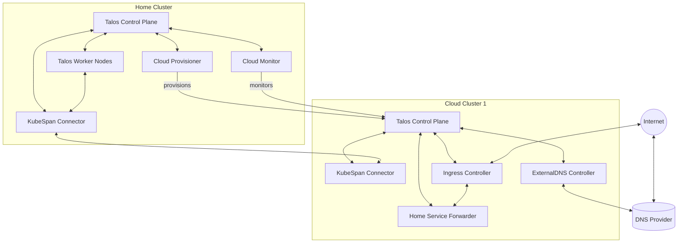

# talos-autoextender
automatically extend your home talos cluster into the cloud

## Overview

This project aims to create a robust, automated solution for bridging a **home-based Talos Kubernetes cluster** (with limited, unreliable, or asymmetric internet connectivity) to one or more **cloud-based Talos clusters** (initially Akamai/Linode and Hetzner, but extensible to others). The system will enable secure, seamless exposure of home-hosted services to the internet via cloud ingress, with dynamic DNS, automated failover, and minimal manual intervention.

---

## Goals

- **Expose home services** to the public internet via cloud ingress points, even with unreliable home internet.
- **Automate provisioning** of cloud Talos clusters (starting with Akamai/Linode and Hetzner).
- **Link clusters** using [KubeSpan](https://www.talos.dev/v1.6/kubespan/introduction/) for secure, encrypted networking.
- **Automate DNS management** so that a domain or subdomain always points to the current, active cloud ingress.
- **Support seamless migration** between cloud clusters or providers without downtime for exposed services.
- **Keep all sensitive credentials secure** and automate their rotation and injection.
- **Minimize manual configuration** after initial setup.

---

## Use Cases

- Home lab users who want to host services at home but require reliable public ingress.
- Anyone with a Talos cluster behind NAT, CGNAT, or dynamic IPs.
- Users who want to failover or migrate cloud ingress endpoints with minimal disruption.

---

## Requirements

### Functional Requirements

1. **Home Cluster Prerequisites**
   - Runs Talos Linux as a Kubernetes control plane and/or worker node(s).
   - Has outbound internet access (no need for static IP or inbound port forwarding).
   - Can run a lightweight service for KubeSpan discovery (optional: Headscale for advanced NAT traversal).

2. **Cloud Cluster Provisioning**
   - Support for Akamai/Linode and Hetzner as first-class cloud targets.
   - Automated creation of Talos clusters in supported clouds, including:
     - VM provisioning
     - Talos image deployment
     - Secure bootstrapping and KubeSpan configuration
     - Ingress controller deployment

3. **Networking**
   - Automatically establish KubeSpan (WireGuard) mesh between home and cloud clusters.
   - Ensure all ingress traffic to cloud clusters can be securely forwarded to home cluster services.
   - Allow for direct pod-to-pod communication across clusters.

4. **Ingress and DNS**
   - Deploy and configure ingress controllers (e.g., Cilium, NGINX) on cloud clusters.
   - Automate DNS record management for a user-controlled domain (e.g., `home-cluster.net` or subdomain).
   - Support blue/green or weighted DNS for seamless migration between cloud clusters.
   - Terminate TLS at the cloud edge using Let's Encrypt or similar.

5. **Failover and Migration**
   - Allow for easy provisioning of new cloud clusters (in new regions or providers).
   - Seamlessly update DNS and ingress to point to new cloud cluster(s), with minimal/no downtime.
   - Cleanly decommission old cloud clusters.

6. **Security**
   - Securely manage and inject cloud provider credentials.
   - Encrypt all sensitive data in transit and at rest.
   - Support for automated credential rotation.

7. **Automation**
   - Provide a CLI or web-based installer for initial setup.
   - Use Infrastructure-as-Code (Terraform, etc.) for reproducibility.
   - Integrate with CI/CD (e.g., Gitea Actions) for cluster lifecycle management.

### Non-Functional Requirements

- **Extensibility:** Easy to add support for additional cloud providers.
- **Modularity:** Components (provisioning, networking, DNS, etc.) should be replaceable.
- **Documentation:** Comprehensive guides for setup, troubleshooting, and extending the system.
- **Observability:** Logging and monitoring for all critical components.
- **Resilience:** Should tolerate intermittent home connectivity and recover gracefully.

---

## Architecture Overview

This refined architecture shows:

1. **Home Cluster**: Contains the Talos control plane and worker nodes, along with components for:
   - KubeSpan connectivity to cloud clusters
   - Cloud Provisioner for automatically deploying cloud infrastructure
   - Cloud Monitor for checking health and availability of cloud resources

2. **Cloud Cluster**: Each cloud cluster (shown is Cloud Cluster 1) consists of:
   - A single "Talos Control Plane" object
   - KubeSpan Connector for secure networking with the home cluster
   - Ingress Controller handling external traffic
   - Home Service Forwarder routing traffic to the appropriate services in the home cluster
   - ExternalDNS Controller managing DNS records

The system allows for multiple cloud clusters to be provisioned as needed, with automatic failover capabilities managed by the home cluster components.

---

## Project Roadmap

1. **Initial Setup**
   - Write Terraform modules for Akamai/Linode and Hetzner Talos clusters.
   - Script KubeSpan setup and home cluster integration.
   - Deploy simple ingress controller and DNS automation.

2. **Automation & UX**
   - Build CLI installer for setup and credential management.
   - Add CI/CD integration for cluster lifecycle.

3. **Advanced Features**
   - Blue/green DNS migration.
   - Automated failover and monitoring.
   - Support for more cloud providers.

---

## Getting Started

_(To be filled as the project progresses; will include prerequisites, installation, and usage instructions.)_

---

## Contributing

- Issues and PRs welcome!
- See [CONTRIBUTING.md](CONTRIBUTING.md) for guidelines (to be written).

---

## License

MIT

